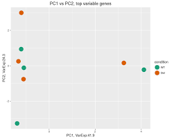
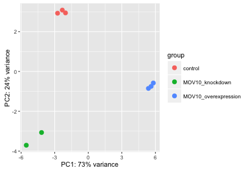

# ACP description 

Principal Component Analysis makes it possible to project a high-dimensional dataset (where the number of dimensions equals the number of genes or transcripts) onto two or three dimensions. This helps in **identifying outlying samples for quality control**, and gives a feeling for the **principal causes of variation in a dataset**. 

The analysis proceeds by transforming a large set of variables (in this case, the counts for each individual gene or transcript) to a smaller set of orthogonal principal components. The first principal component specifies the direction with the largest variability in the data, the second component is the direction with the second largest variation, and so on.

For instance, this PCA show a batch effect :  

whereas this PCA explains very well the 3 biological groups :

You can exlude samples or groups in `Data selection panel` then click on Run to visualize the PCA without these samples/groups.
